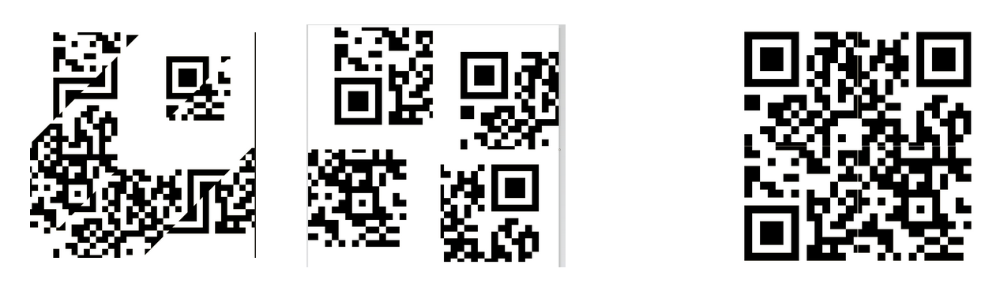

# Quick Recovery
> Hey, check this QR code ASAP! It's highly sensitive so I scrambled it, but you shouldn't have a hard time reconstructing - just
> make sure to update the a_order to our shared PIN. The b_order is the reverse of that 

## Solution

we are given two things, a program that "obscures" the qr code into different triangles
and the qr code that has been "scrambled"

The program is the one that scrambles it

Renaming the obscured.png to “qr_code.png” for the program to “reobscure” it lets us mess around with it

Just trying 1234 and 4321 for the two obsucring variables Gives me a new obscured qr code, this one is split into 4 nice even squares

these are just out of place and not near each other, so we need to rearrange them

Going into paint and rearragning them works, and trying to open the qr code with my phone gives me the flag, the image shows the orignal qr code, the one I un scrambled and the one I fixed with paint.


```shell
INTIGRITI{7h475_h0w_y0u_r3c0n57ruc7_qr_c0d3}
```
